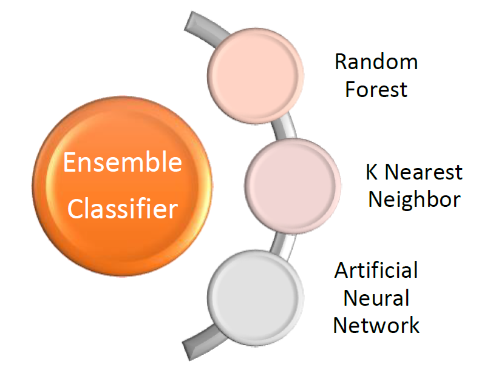
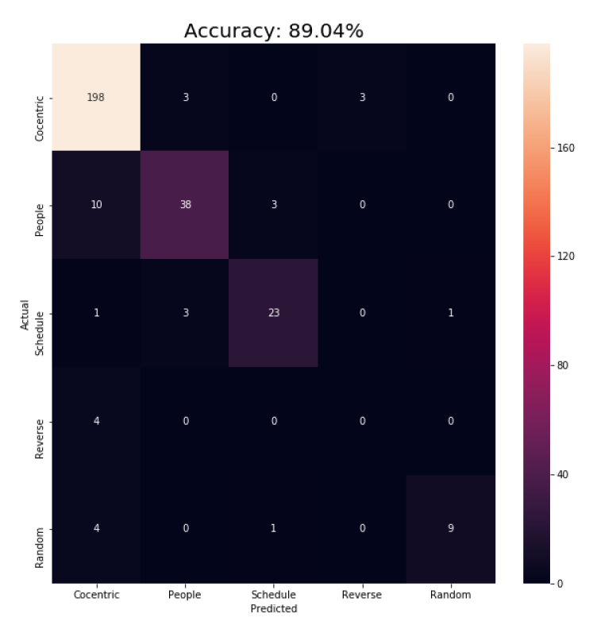

# EnergyWatch - Georgia Tech Building Energy-Usage Classification

## Overview
The goal of this project is to detect outlier cases of energy usage of the 137 buildings on the Georgia Tech campus using energy consumption data. These outlier cases often represent energy mismanagement, overconsumption, or electric issues. Our main approach to detecting if a building’s behavior has changed is to first be able to classify a building’s behavior based on its energy usage or “fingerprint”. The fingerprint is a polar plot of the energy usage of a building over 24 hours. The data is collected and plotted in 15 min intervals. Notable differences in the energy signatures allow us to classify a building’s consumption behavior into 5 types: Concentric, People, Scheduler, Reverse, and Random. 

## Project Details
The data that we are using to build this classifier comes from a server that has been recording 15-min intervals of energy usage for more than 3 years. This project was developed using Python (version 3.5) and Jupyter notebooks. Several machine learning libraries were used including Pandas, Numpy, and Scikit-Learn. 

## Machine Learning Algorithms
Machine learning algorithms perform well on pattern recognition (classification) problems given sufficient examples. In order to classify the energy usage, a number of different machine learning models were selected and tested. 2,926 energy signatures were manually labelled for training purposes. In order to increase the size of the dataset, artificial data generation and data manipulation was attempted. Defining the classification prototypes was an iterative process of creating the classifiers and analyzing misclassified cases. Since buildings with very little energy consumption have very volatile energy usage, such buildings were filtered out of the dataset at different threshold values. Of the seven classification algorithms, the three that consistently performed the best were: Random Forests, K-Nearest Neighbors, and Artificial Neural Network. These models were put into a voting Ensemble classifier to achieve a classification accuracy of 89.04% with a threshold of 75kwH average 15-min energy usage. 

## Areas for Improvement
If this project was repeated then we would spend more time on data exploration in order to obtain a clear definition of classification prototypes.
There are a number of strategies that can be implemented to improve on this project. Grid search can be used for parameter optimization. More specific classifiers can be developed to classify low-consumption cases that we previously filtered out. Statistical techniques can be applied to identify consumption anomalies. Regression models can be created to predict energy consumption.

## Additional Details
Additional details about the project can be found in the pdf report in the current directory.

## Ensemble Architecture and Confusion Matrix

## Usage
* Step 1: Ensure that the current environment has Python 3.5 or higher, Jupyter Notebooks. Install the following dependencies: Numpy, Matplotlib, pandas, seaborn, export_graphviz, pydotplus. You can use pip install or conda install to acquire these dependencies.

* Step 2: From your command prompt or terminal move into the file attached wherever it may be stored. Once in the current directory run ‘jupyter notebook’ to launch jupyter notebook.

* Step 3: Click on on ‘Building Energy Usage Fingerprints.ipynb’ to launch the notebook in browser. 

* Step 4: On the top menu bar click ‘Kernel’ and then click ‘Restart & Run All’. You can also run individual cells by clicking inside of the cell and pressing ‘Ctrl + enter’.

* Step 5: To fine tune the decision tree accuracy test different values for the ‘min_impurit_split’ parameter between 0.2 and 0.5. For the KNN refer to the n_neighbors vs Accuracy graph to select the highest performing k value in terms of test accuracy.

## Data
This data is from the Georgia Institute of Technology. Please request permission before use of data.

## Acknowledgements
This project is guided by Dr. Lewe of the Areospace Design Lab at the Georgia Institute of Technology.